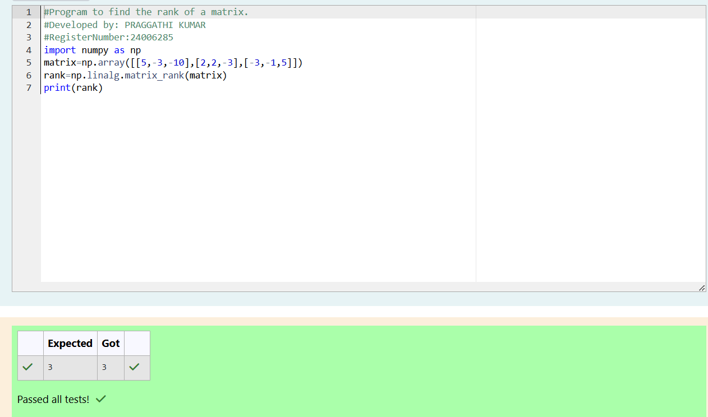

# RANK-OF-A-MATRIX
## Aim:
To write a python program to find the rank of a matrix
## Equipment’s required:
1. 	Hardware – PCs
2. 	Anaconda – Python 3.7 Installation / Moodle-Code Runner
## Algorithm:
### Step 1: import numpy as np
### Step 2: using np.array() store the matrix in the variable marix
### Step 3: Using the np.linalg.matrix_rank(), we can find the rank of the given matrix.
### Step 4: print the rank of the matrix
## Program:
### import numpy as np
### matrix=np.array([[5,-3,-10],[2,2,-3],[-3,-1,5]])
### rank=np.linalg.matrix_rank(matrix)
### print(rank)
## Output:

## Result:
Thus the rank for the given matrix is successfully solved by  using a python program.

